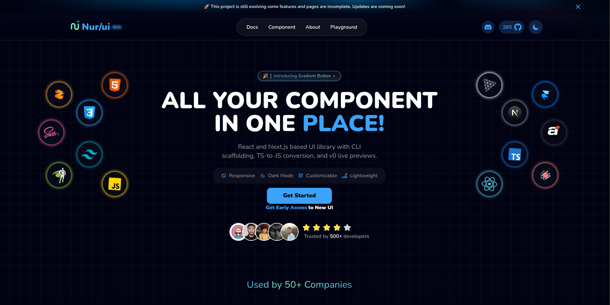

<h1 align="center">
  
</h1>

<p align="center">Nur/ui is a modern React and Next.js based UI component library that streamlines front-end development. It offers CLI scaffolding, automatic TypeScript to JavaScript conversion, and live component previews for a faster, more customizable workflow.</p>



## Documentation

Visit https://nurui.vercel.app/docs/installation to view the documentation.

## 🚀 Quick Start

### Option 1: Using Docker (Recommended for Production)

Prerequisite: Docker & Docker Compose installed.

```bash
# 1. Clone the repository
git clone https://github.com/afsar-dev/Nurui.git
cd Nurui

# 2. Create production environment file
cat .env.production
#  The project uses the existing .env.production file.
#  You can modify it if needed.

# 3. Build and start with Docker Compose
yarn docker:compose:up
# Or manually:
docker compose up -d

# The production application will be available at http://localhost:3000
```

### Option 1.1 — Run With Docker (Without Compose)

If you prefer to run Nurui using standard Docker commands:

```bash
# 1. Build Docker Image
yarn docker:build
# Or manually:
docker build -t nurui:latest .

# 2. Run Container
yarn docker:run
# Or manually:
docker run -d \ --name nurui \ -p 3000:3000 \ --env-file .env.production \ nurui:latest
```

### Option 2: Local Development Setup

```bash
# 1. Clone the repository
git clone https://github.com/afsar-dev/Nurui.git
cd Nurui

# 2. Create a .env.development file (or .env) file in the root directory
cat .env

# Add to .env file:
# NODE_ENV=development

# 3. Install dependencies
yarn install

# 4. Start the development server
yarn dev

# The application will be available at http://localhost:3000
```

## 🔧 Environment Variables

Create a `.env.production` file for Docker deployment:

```bash
NODE_ENV=production
ANALYZE=false
NEXT_TELEMETRY_DISABLED=1
```

For local Development (.env or .env.development):

```
NODE_ENV=development
ANALYZE=false
```

## License

Licensed under the [MIT license.](https://github.com/afsar-dev/Nurui/blob/main/LICENSE)

## Contributing

visit this [Documentation](https://github.com/afsar-dev/Nurui/blob/main/CONTRIBUTING.md)

<!-- ## Support

If you find this project useful, please consider [sponsoring me](https://github.com/sponsors/your-username).

[](https://github.com/sponsors/your-username) -->

## Maintainer

**Md Afsar Mahmud**  
Full Stack Developer  
[HackerRank](https://www.hackerrank.com/profile/mdafsar) •
[LinkedIn](https://www.linkedin.com/in/md-afsar-mahmud)
